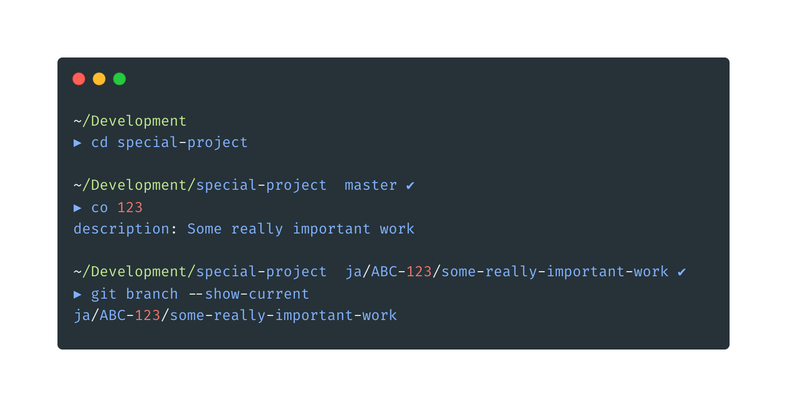

# 💡 gitter (better name pending)

## Installation

```shell
go install github.com/jackall3n/gitter
```

## Example


## Usage

### Checkout

`checkout` will use a configuration file to format your branch name

```shell
gitter checkout [ticket] [description]
```

#### With alias
```shell
# ~/.zshrc
alias co="gitter checkout"
```
```shell
co [ticket]
```

### Commit

`commit` will append the ticket from the branch name to the start of the commit message

```shell
gitter commit [message]
```

#### With alias
```shell
# ~/.zshrc
alias cm="gitter cm"
```
```shell
cm [ticket]
```

#### Example
```shell
Development/bulb-git/account  master ✗                                                                                          15h19m  
▶ co 123                
description: Something really important

Development/bulb-git/account  ja/UAP-123/something-really-important ✗                                                        15h20m ◒  ⍉
▶ cm
message: The important work

Development/bulb-git/account  ja/UAP-123/something-really-important ✔                                                               2m  
▶ git log -1 --oneline
(HEAD -> ja/UAP-123/something-really-important) [UAP-123]: The important work
```


## Configuration

Add a `.gitter.yaml` configuration to your `$HOME` directory, or your project root
```shell
# Global config
touch ~/.gitter.yaml

# Project specific
touch ~/development/special-project/.gitter.yaml
```

#### Example

```yaml
# ~/.gitter.yaml
prefix: ja
board: ABC
```

